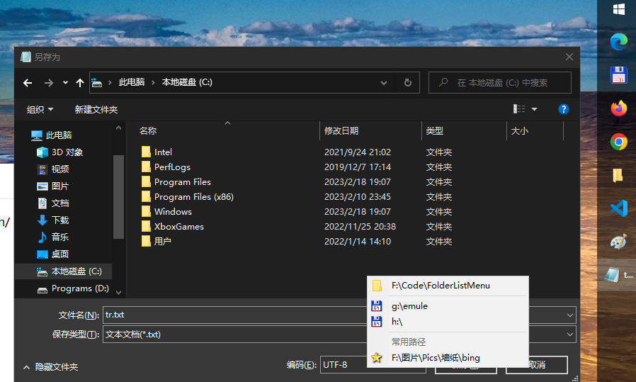

# FolderMenuList  

## 功能：
在“打开”或“保存”对话框弹出时，按下 <kbd>Ctrl + G</kbd>，会在鼠标处弹出一个菜单，包含当前已打开文件夹的路径，点击菜单，会在“打开”或“保存”对话框中快速定位到对应路径。支持 Total Commander 和自定义常用文件夹。

修改自 xml123 发布在[小众软件官方论坛](https://meta.appinn.net/)的一段脚本，用 AHK v2 重写并借鉴了 Easy Access to Currently Opened Folders 中的对话框处理方法。
## 致谢：  
- [script](https://meta.appinn.net/t/topic/3743/34) by xml123  
- [Easy Access to Currently Opened Folders](https://gist.github.com/akaleeroy/f23bd4dd2ddae63ece2582ede842b028) by Leeroy 

## 更新记录：
2023-02-14  **v1.1.1**
> - 为应对非系统标准对话框（如 WPS 等）：加入了控件检测，整合了两种处理方式。

2023-02-12  **V1.1.0**
> - 新的菜单句柄，提高可靠性
> - 删除冗余代码

2023-02-11  **v1.0.0**
> - 用 AHKv2 重写    
> - Total Commander 菜单显示其自身图标
> - 菜单最下方为常用路径，且显示专属图标  